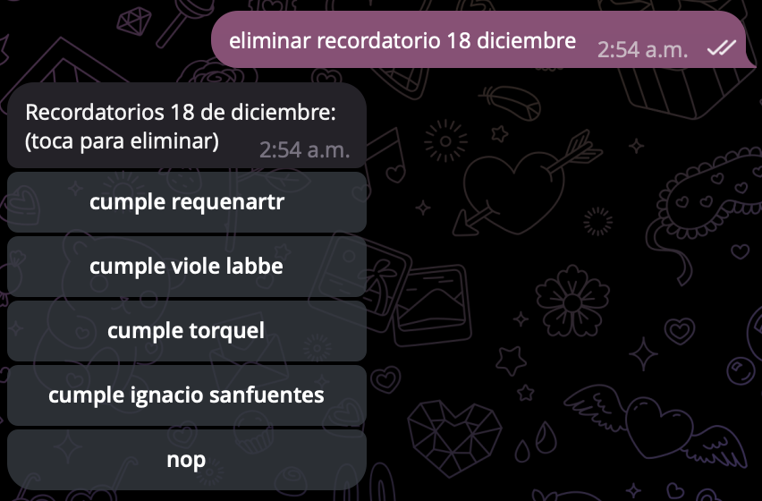

# recordatorioSQL

This package is to get my reminders in my virtual assistant. Most of them being birthdays.  
  
I used to do this with **JSON**, but converted it to **SQL** to make it more reliable (Via sqlite3).


## Usage
  
This is one of my most used functions of my virtual assistant. It runs in a Raspberry Pi, that is not powerfull enough to run Artificial Intelligence models; and Natural Language in Spanish do not work as very well, so I've tryed to make it the most naturallanguaged as possible.  
It keeps the reminders and everyday it checks if there's something scheduled. Then it sends it to the user (just me for now), few times during the day until posted as completed or deleted. It also checks for reminders the night before, and one week before. So it would tell you "_reminder in one week: Cecilia’s Birthday_". And if it is the word _birthday_ in it, it adds a party, balloon, or cake emoji to the messaje. Details.  
All this interactions happens via Telegram and the Telegram API.  

### Requests
So you first ask for something by calling:
```python
import recordat

recordat.orio(chat_id = 7654321, vaina = '<<request here>>')
```
#### Getting
The word _Recordatorio_ means _Reminder_, hence the name. 
The **request** might be one of many options:
If you want to check at your reminders you can ask for them as:

- Dame mis recordatorios - _Give me my reminders_.
- Me darías mis recordatorios - _Would you give me my reminders_.
- Muestrane mis recordatorios - _Show me my reminders_.
- Mandame mis recordatorios - _Send me my reminders_.

Just showing how it consider differents words and conjugations.

You can also specify the month you want:
- Dame mis recordatorios de septiembre - (_Give me my reminders of September_).

That would be something like:
```python
print(recordat.orios(7654321, "dame mis recordatorios de abril"))

# English Translation
print(recordat.orios(7654321, "get my April reminders"))
```

```yaml
# output
• APRIL •
02 - License paperwork
   - Get groceries
14 - Jerry's Birthday
23 - Dinner with family
```

**Note** _: I'm gonna proceed by exposing all the examples in English for understanding, even though all is made to work in Spanish._

#### Searching
If you don’t remember when that birthday was, you can just ask for it:
```python
print(recordat.orios(7654321, "search in my reminders for Javier's birthday"))
```
getting:
```yaml
# output
• JAVIER'S BIRTHDAY on June the 3rd

similar coincidences:
7/13th - daniel's birthday
31/10th - call javier's mum
```
It finds the similar or probable ones using [the fuzz](https://github.com/seatgeek/thefuzz) module.

#### Deleting
When it sends the reminders it does it sending it with two buttons: **Done** and **Delete**. So is not very common to use this function. But if by any misskeyed or something is needed to delete a reminder the commands would be:
```python
print(recordat.orios(7654321, "delete reminder January 9th"))
```
And it would return a list with the reminders of that day where you tap the one that you want to be deleted, as shown below:

<p align="center">
  
</p>

#### Creating
To create reminders you just tell to it that you want a reminder, when, and what. There are a couple of ways to do it so:
```python
- "reminder march 12th important thing to do"
- "reminder tomorrow take the cardboard to the school"
- "reminder next Tuesday get prepared for the volleyball match"
```
The nice thing is that the responses tell you how much time is left:
```yaml
-> Reminder March 12th created (3 months 2 days left).
-> Take the cardboard to the school (Tomorrow).
-> Next Thursday: *get prepared for the volleyball match* (in 4 days).
```

## Features

- **SQL**: Very fast.
- **Fuzzy Searcher**: Don’t worry about small misspellings.
- **Time Left**: How long until your special date.
- **Spanish Verbs Conjugation Considerer**: Spanish, opposite than English, has many ways of verbs conjugatios. Here we consider that.
- **Week Days**: You can say "_reminder next Thursday this and that_".

## Contributions

Contributions are welcome! If you have improvements or fixes, please send a pull request or open an issue in the GitHub repository.

## License

This project is licensed under the MIT License. See the `LICENSE` file for more details. Use it as you like.

## Contact

Nico Spok - nicospok@proton.me
GitHub: niCodeLine
